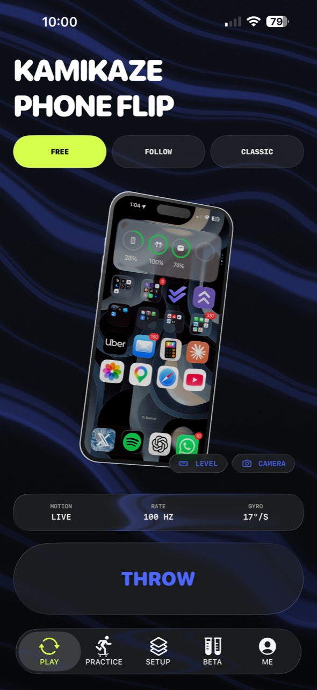
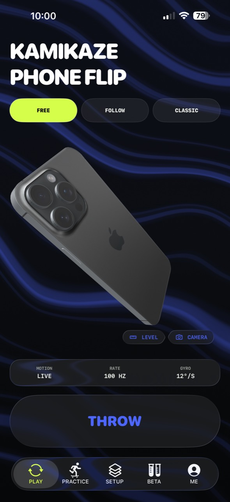
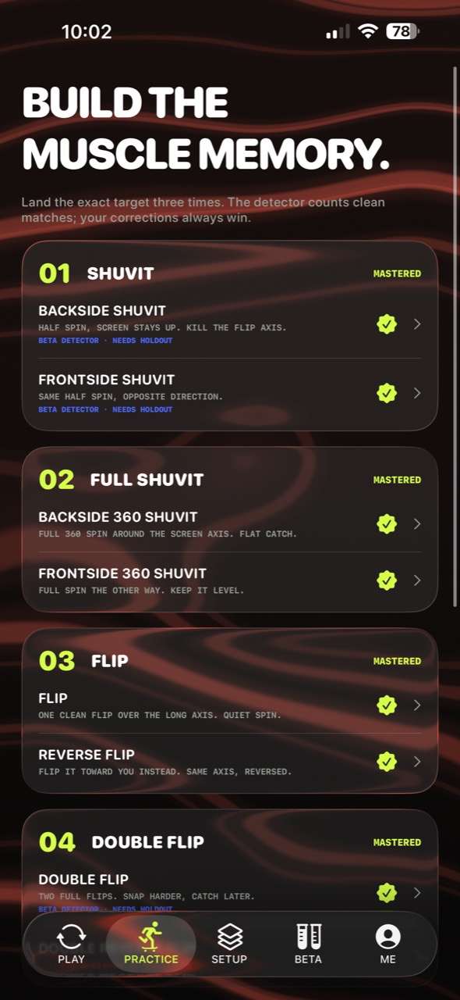
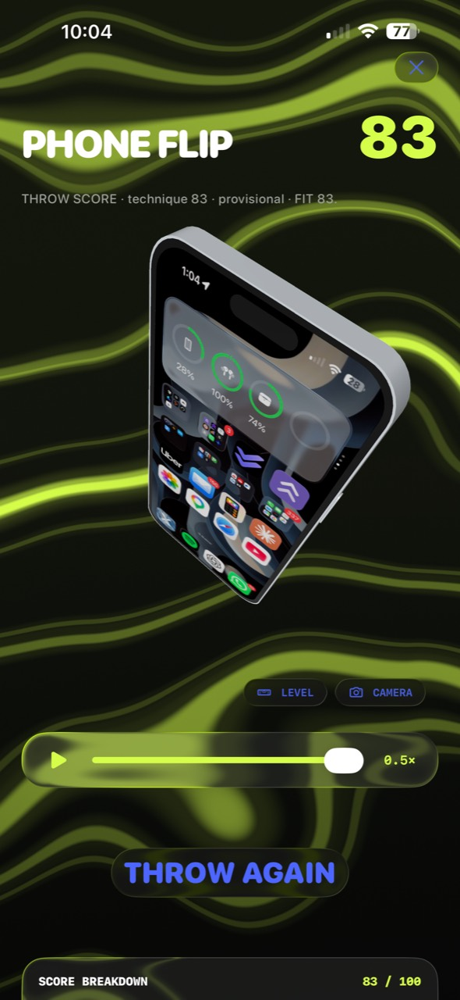

<div align="center">

# KAMIKAZE: PHONE FLIP

**Throw your phone. Land the trick.**

Kamikaze turns your phone into the board. Its motion sensors capture physical
phone tricks, identify the movement, score the execution and reconstruct it as
an interactive 3D replay.

`THROW → TRACK → LAND → REPLAY`

</div>

<p align="center">
  
  
</p>

## The phone is the board

Phone Flip started with a simple physical game: throw a phone, catch it and see
how high it went. Kamikaze expands that idea with the vocabulary of skateboarding.
A Flip, Shuvit or compound Phone Flip becomes measurable motion rather than a
button press.

The current loop is deliberately physical:

```text
THROW  →  CAPTURE  →  SEGMENT  →  IDENTIFY  →  SCORE  →  REPLAY
```

- **Play** detects a single trick and returns an immediate result.
- **Follow** calls a trick and condition for structured detector training.
- **Classic** returns to the original Kamikaze challenge: throw for height.
- **Practice** teaches a target, watches the attempt and builds mastery over time.
- **Replay** reconstructs the recorded orientation in an interactive 3D scene.
- **Camera** records a run with front/rear sources and turns measured motion into
  a shareable 3D clip with an editable vertical cut.
- **Feed** presents community throws as a paged, autoplaying 3D experience and
  lays the foundation for shared trick evidence.
- **Setup and Profile** keep phone models, custom screens, history, records,
  accounts and progression.

<p align="center">
  
  
</p>

## Platforms

Kamikaze is a multiplatform project with separate implementations that share
motion evidence without coupling their build systems.

| Platform | Stage | Role today |
| --- | --- | --- |
| **Native iOS** | Active beta · most developed | The lead implementation: SwiftUI, Core Motion, RealityKit, Liquid Glass, gameplay, Practice, persistence and 3D replay. |
| **Expo / React Native** | Active alpha | The cross-platform prototype, runnable in Expo Go and the main contribution path toward Android. |
| **Web** | Archived exploration | The original browser-based sensor and gameplay research, preserved as project history. |

The native beta prioritizes iOS 26 while retaining deliberate fallbacks for
recent iPhones on iOS 18–25. The physical reference device is an iPhone 15 Plus,
but motion logic must not hardcode one phone model, hand or screen size.

## Detection status

The detector is a versioned, evidence-driven system—not a black-box accuracy
claim. Raw motion, segmentation, classification, scoring and player correction
remain separate contracts.

- Physically validated definitions cover the current core trick set.
- BS/FS Shuvit 180 and Double Flip are visible beta candidates derived from the
  labelled V4 development dataset and still require an independent holdout.
- Unsupported doubles remain evidence-collection targets rather than pretending
  to be reliable automatic detections.
- Matcher fit describes identity similarity; it is not a calibrated probability
  that the trick landed.

See [`docs/NATIVE_DATASET_PROTOCOL.md`](docs/NATIVE_DATASET_PROTOCOL.md) and the
versioned audits in [`docs/`](docs/) before changing detector behavior.

## Run the native iOS beta

Requirements: Xcode 26, Swift 6 and an iPhone or iOS Simulator. Physical motion
testing requires a real device.

```sh
open apps/ios/Kamikaze/Kamikaze.xcodeproj
```

Test the platform-independent motion core without opening Xcode:

```sh
swift test --package-path apps/ios/Packages/KamikazeMotionCore
```

For signing, simulator destinations and Personal Team installation, see the
[`native iOS guide`](apps/ios/README.md).

## Run the Expo alpha

```sh
cd apps/expo
npm install
npx expo start --lan
```

Scan the QR code with Expo Go on a phone connected to the same reachable network.
The browser and simulators do not provide representative motion-sensor evidence.
See the [`Expo guide`](apps/expo/README.md) for the preserved workshop and alpha
workflow.

## Releases

The iOS app uses semantic product versions plus an increasing Apple build
number. A substantial change first ships as a release candidate, is installed
on a physical iPhone and passes the release checklist before the same version is
marked stable.

- App version: `0.2.0` · build `2`
- Candidate tag: `native-ios-v0.2.0-rc.1`
- Release notes: [`CHANGELOG.md`](CHANGELOG.md)
- Historical milestones: [`docs/HISTORY.md`](docs/HISTORY.md)

## Repository map

| Path | Purpose |
| --- | --- |
| [`apps/ios/`](apps/ios/README.md) | Native iOS beta and the pure Swift motion packages. |
| [`apps/expo/`](apps/expo/README.md) | Cross-platform alpha and Android contribution track. |
| [`fixtures/`](fixtures/motion/v3/README.md) | Reviewed motion captures used for reproducible detector and replay tests. |
| [`datasets/`](datasets/README.md) | Versioned manifests, splits and evaluation records. |
| [`docs/`](docs/) | Product decisions, detector contracts, audits and handoffs. |
| [`archive/web-prototype/`](archive/web-prototype/README.md) | Original web sensor/game prototype. |
| [`archive/explorations/`](archive/explorations/README.md) | Preserved runnable snapshots of early divergent experiments. |

## Contributing

Choose one implementation boundary for a normal feature pull request:

- Android or cross-platform work belongs in `apps/expo/`.
- Native Apple-platform work belongs in `apps/ios/`.
- Shared detector evidence belongs in `fixtures/` only after review.
- Historical snapshots stay unchanged in `archive/`.

Read [`CONTRIBUTING.md`](CONTRIBUTING.md) before changing shared detector
behavior, fixture formats or both active applications in one pull request.

## Safety

The name is Kamikaze. Your testing setup does not have to be. Start low, use a
protective case and practice over a bed or another soft surface. Throwing a phone
can damage the device, nearby objects or people; you are responsible for where
and how you test it.

## History

The repository intentionally preserves the path from browser research to the
Expo alpha and the current Swift beta. See [`docs/HISTORY.md`](docs/HISTORY.md)
for milestones, tags and instructions for opening an older version safely.
