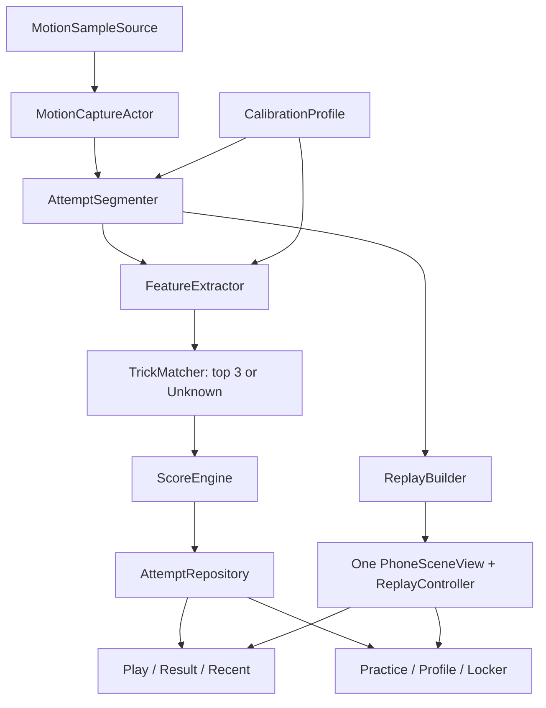

# Kamikaze: Phone Flip — master development plan

Status: execution active. Section 0 preserves the physically validated detector under `native-beta-device-detector-v0.1.0`. Section 1 has a schema-v3 foundation, verified immutable Expo-v2 seed fixtures and an iPhone raw-recorder integration in progress.

This is the operating plan for turning the current Swift vertical slice into a complete, trustworthy and polished native beta. It complements `NATIVE_SWIFT_MIGRATION.md` (architecture) and `NATIVE_BETA_EXECUTION.md` (migration decisions).

## Product goal

Build a phone-trick game whose core loop feels immediate:

```text
OPEN → ZERO → ARM → TRICK → CATCH → RESULT → REPLAY → AGAIN
```

The phone is the player avatar. Sensor evidence is the source of truth. The app must prefer `Unknown` over a confident wrong label, must never require a dangerously high throw to recognize a trick, and must never leave a capture or replay stuck.

## Current checkpoint

Validated on Daniel's iPhone 15 Plus, right hand:

- native app installs with a Personal Team;
- Core Motion is available and the live RealityKit pose follows the phone correctly;
- Zero Pose and camera orbit/pinch work in Play;
- detector commit `179e124` contains an initial automatic detector with freefall and gyro triggers;
- the detector now closes low tricks and has a bounded safety timeout;
- synthetic Phone Flip, shuvit and timeout detector tests pass.

Not complete yet:

- the detector and latest visual foundation are committed separately on `ios/beta-checkpoint`;
- only Phone Flip and Reverse Phone Flip have real labelled fixtures;
- native manual capture, persistence, Result, Recent and recorded replay do not exist;
- Practice, Locker, Profile and Workshop are shells/placeholders;
- scoring is currently confidence displayed as points;
- calibration, candidate ranking, `Unknown`, lines and custom tricks are not native;
- there is no repository-owned CI.

## Delivery principles

1. Preserve raw evidence. A displayed label can change; captured samples cannot.
2. Separate segmentation from classification. Where the trick starts and ends must not depend on its guessed name.
3. Use one replay/3D implementation everywhere.
4. Derive Practice progression, Profile statistics and Locker rewards from persisted attempts.
5. Physical motion changes require physical-device evidence. Simulator evidence is UI-only.
6. The primary integrator owns shared contracts, commits and merges.
7. At most three subagents run beside the integrator, and write-heavy tasks with overlapping paths run sequentially.
8. The Expo alpha remains the Android/reference track; `archive/` remains history and is excluded from CI.

## Target architecture



Keep only the two existing Swift packages initially:

- `KamikazeMotionCore`: schemas, math, segmentation, features, matching and scoring; no Apple UI/framework dependencies.
- `KamikazeMotionApple`: Core Motion source, permissions and Apple-specific capture adapter.
- App target: SwiftUI features, RealityKit, persistence, design system and platform lifecycle.

Do not create a Swift package for every screen.

## Agent roster

The names below are reusable roles, not permanent agents.

| Role | Default model | Owns | Must not own |
|---|---|---|---|
| **Integrator** | Sol | architecture, shared contracts, task scopes, review, tests, device acceptance, commits and merges | large unreviewed feature implementation in parallel with integration |
| **Motion & Evidence** | Sol | schemas, fixtures, capture quality, segmentation, classifier, calibration and evaluation | SwiftUI visuals, persistence UI, release signing |
| **Replay & Data** | Terra | sample store, SwiftData metadata, replay clock/sampling, RealityKit modes and replay tests | detector thresholds and trick vocabulary |
| **Play Experience** | Terra | run coordinator, Play/Result/Recent flow, manual/auto UX, score presentation and correction UX | sensor math and storage schema invention |
| **Practice & Workshop** | Terra | guided levels, target/actual comparison, express/full calibration UI and custom-trick recording | renderer forks and detector tuning |
| **Game Systems** | Terra | Profile, history, activity, records, Locker, skins and local reward rules | raw sensor processing |
| **Native Experience** | Terra | Liquid Glass system, Slipstream background, Flux Halo, navigation, typography, haptics, sound and accessibility | motion/replay contracts |
| **Quality & Release** | Terra | CI, test harnesses, performance, device protocol, privacy and release gates | cross-feature redesigns; it routes fixes to owners |

Luna is not exposed as a subagent override in the current environment. Do not silently claim or substitute it. Sol handles high-risk motion architecture; Terra handles bounded feature work and QA.

## Sections and execution order

### Section 0 — Stabilize the validated baseline

**Lead:** Integrator

**Reviewer:** Quality & Release

Deliverables:

- separate, intentional commit for the detector Daniel validated physically;
- separate visual-system commit if the current diff cannot be reviewed safely as one unit;
- documentation updated to match reality;
- tag such as `native-beta-play-v0.1.0` after tests and device smoke test;
- known-issues list and physical test protocol.

Exit gate:

- clean worktree;
- MotionCore tests pass;
- Simulator build passes;
- signed iPhone build installs;
- Play reaches `ARMED → MOTION → LANDING → result` and cannot hang indefinitely.

### Section 1 — Motion contract and evidence dataset

**Lead:** Motion & Evidence

**Reviewer:** Integrator

**Parallel support:** Quality & Release may build the fixture harness read-only.

Deliverables:

- native attempt schema v3 while retaining v2 decoders;
- raw sample: monotonic timestamp, gyro rad/s, user acceleration, gravity, fused attitude, sequence/gap flags;
- attempt metadata: device/OS, hand, orientation, requested/measured Hz, calibration ID, detector/analysis/score versions;
- immutable fixture manifest and checksums;
- iPhone recorder/export action for labelled and negative captures;
- real fixtures for six core tricks, Straight Air, misses and ordinary handling.

Original core trick set for this gate (display names corrected after physical
review; see `PRACTICE_PROGRESSION_V1.md`):

- Phone Flip / Reverse Phone Flip;
- Flip / Reverse Flip;
- Frontside 360 Shuvit / Backside 360 Shuvit;
- Straight Air / Unknown.

Dataset target before claiming classification quality:

- 20 attempts per core trick;
- fast/low and slow/high variants;
- 10 Straight Air;
- 30 negative/no-trick movements;
- case/no-case and imperfect catches;
- sessions kept separate between training/tuning and holdout evaluation.

Exit gate:

- v2 fixtures still decode;
- v3 round-trips deterministically;
- physical session replay through the harness reproduces sample order and timing;
- no precision claim is made from synthetic tests alone.

### Section 2 — Capture engine and segmentation

**Lead:** Motion & Evidence

**Reviewer:** Integrator + Quality & Release

Deliverables:

- `MotionSampleSource` protocol with real and fixture implementations;
- `MotionCaptureActor` with ring buffer, measured rate, gaps/drops and lifecycle handling;
- UI publication throttled separately from the 100 Hz evidence stream;
- auto segmentation with freefall and gyro triggers, pre/post-roll, motion start/end, catch, settled and timeout;
- manual recording that isolates the primary burst offline;
- cancellation, backgrounding, interruption and refractory-period behavior;
- developer timeline showing the exact phase transition and trigger reason.

Exit gate on iPhone 15 Plus:

- no capture exceeds 3.6 s unless it is explicitly manual;
- valid result appears within 500 ms after stable catch;
- 19/20 valid attempts per core trick produce a closed capture before classifier accuracy is considered;
- less than 2% false attempts during ten minutes of normal phone handling;
- no evidence samples are dropped because SwiftUI/RealityKit is rendering.

### Section 3 — Persistence and one replay engine

**Lead:** Replay & Data

**Reviewer:** Integrator

**Dependency:** stable schema from Section 1. Scaffold may start early; integration follows Section 2.

Deliverables:

- SwiftData for indexed metadata;
- versioned raw sample payloads under Application Support;
- atomic temp-write/checksum/rename sequence;
- explicit v2 → v3 import without destroying originals;
- `AttemptRepository` and `SampleStore` protocols;
- one `PhoneSceneView` mode system: live, replay, target, comparison and locker;
- one display-linked/clock-driven `ReplayController`;
- play/pause, scrub, 0.25×/0.5×/1×, orbit, pinch, Reset Camera and Zero Pose as separate concepts;
- correct gesture precedence over parent scrolling;
- Result and historical Attempt Detail consume the same view/model.

Exit gate:

- an attempt survives force-quit and cold launch with samples and analysis intact;
- playhead and visible phone advance in Result, Recent and Practice;
- slider seeking is within one sample interval;
- dragging/pinching the 3D stage never scrolls the page;
- 100 saved attempts load without UI stalls;
- corrupt/missing payload is recoverable and never crashes or disappears silently.

### Section 4 — Trick intelligence, calibration and scoring

**Lead:** Motion & Evidence

**UI partner:** Practice & Workshop

**Reviewer:** Integrator + Quality & Release

Deliverables:

- coordinate/grip conventions validated rather than copied blindly from Expo;
- express calibration under 60 seconds with ghost phone;
- full calibration for X/Y/Z, ±90°/±360°, adjustable tempo, retries and target/measured replay;
- bias, sign, gain, cross-talk and confidence stored per device/profile;
- feature extraction separated from segmentation;
- transparent classifier returning top three candidates and `Unknown`;
- correction flow that preserves original analysis and records the player's label;
- score 0–100 with versioned internal components: completion/direction, purity, landing/stability and flow;
- mathematical target animation separated from imperfect measured execution;
- custom trick creation requires 3–5 labelled examples.

Exit gate:

- same fixture + versions always yields the same boundaries, candidates and score;
- top-1 ≥90% on session-level holdout for the core set before marketing the detector as accurate;
- shuvit vs Phone/360-family confusion is ≤2/20 per direction;
- ambiguous attempts become `Unknown`, not a fabricated confident label;
- hand changes semantics, never raw samples;
- no fake measured vertical translation. Freefall may use a clearly labelled estimated arc.

Collection-only expansion after the validated v0.2 core:

- Frontside / Backside Shuvit means 180°;
- the already measured full rotations are explicitly 360 Shuvits;
- Double Flip, Double Reverse Flip, Double Phone Flip and Double Reverse Phone
  Flip remain unavailable to automatic recognition until labelled-session and
  independent-holdout gates pass.
- Lines are ordered groups of separately segmented attempts, never a new
  single-trick matcher label.

### Section 5 — Complete the player loop

**Lead:** Play Experience

**Reviewer:** Integrator

**Dependencies:** Sections 2–4 contracts and Section 3 repository/replay.

Deliverables:

- explicit `RunCoordinator` state machine;
- auto and manual single-trick sessions;
- thumb-reachable full-state interaction while manual capture is active;
- animated result with one score, trick label, duration and confidence/Unknown state;
- immediate replay and `Throw Again`;
- candidate/correction flow kept secondary;
- Recent list and Attempt Detail using the exact result/replay component;
- haptic and sound state vocabulary;
- safe interruption and recovery.

Exit gate:

- `READY → ARMED → MOTION → LANDING → RESULT → REPLAY → AGAIN` is understandable without instructions;
- every termination path saves, cancels or reports failure explicitly;
- buttons remain reachable and large while holding the phone;
- one-trick play is reliable before lines are introduced.

### Section 6 — Practice, Workshop and custom tricks

**Lead:** Practice & Workshop

**Motion reviewer:** Motion & Evidence

**Replay reviewer:** Replay & Data

Deliverables:

- ordered levels: both shuvits, Phone/Reverse, Front/Back;
- target animation before each attempt;
- automatic capture by default, manual fallback;
- target vs measured comparison using the shared replay engine;
- three visible repetitions and mastery/unlock rules derived from persisted evidence;
- express calibration accessible from Play;
- full bench and calibration tape in Workshop;
- custom trick recording, multiple examples, editable name and exportable evidence.

Exit gate:

- a level unlocks only from a saved qualifying attempt;
- progress survives cold launch;
- target and measured playback controls behave identically to Result;
- calibration capture can be reviewed backward/forward and exported.

### Section 7 — Profile, history, Locker and local metagame

**Lead:** Game Systems

**Reviewer:** Integrator

Deliverables:

- real totals, per-trick counts, best score, streak, fastest/longest and most-used trick;
- activity calendar with one documented definition of what a cell counts;
- expandable/clickable Recent history;
- deletion/export and local privacy controls;
- points/rewards computed from versioned saved scores;
- selected skin persisted and applied immediately across every phone scene;
- settings for hand, sound/haptics, diagnostics, reduced effects and onboarding replay;
- Workshop nested under Me, not primary navigation.

Exit gate:

- no profile or economy number is hardcoded;
- deleting an attempt updates all derived stats deterministically;
- changing a skin updates the visible phone immediately;
- no accounts, cloud or monetization are required for the native beta.

### Section 8 — Native visual and audiovisual polish

**Lead:** Native Experience

**Reviewer:** Integrator + Quality & Release

**Dependency:** stable player loop. Design tokens may be prepared earlier.

Direction: **motion instrument, not a skate dashboard**. The world is nocturnal polycarbonate, cold metal and kinetic light; the phone remains the hero.

Core visual tokens:

| Token | Value | Use |
|---|---|---|
| Pitch | `#090B0A` | base |
| Ink | `#141817` | depth |
| Frost | `#E9ECF8` | primary type |
| Ion | `#5B73FF` | ready/live |
| Hazard | `#FF603F` | motion/air |
| Volt | `#D7FF4A` | landing/success |

Typography:

- SF Pro Rounded Black for decisive game moments;
- SF Pro Text for instructions and navigation;
- SF Mono for sensor/debug evidence.

Signature interaction: **Flux Halo** around the live phone. It breathes in Ready, compresses while armed, opens with angular energy during motion and resolves into the result on landing.

Background: **Slipstream Field**, a slow native MeshGradient plus restrained Canvas/Metal traces driven by rotation energy and game phase. It exists to give native glass depth and refraction, not to compete with gameplay.

Deliverables:

- glass density scale for navigation, actions and interactive game cards;
- iOS 26 native Liquid Glass with one iOS 18–25 Material fallback boundary;
- transparent layered bottom navigation with content extending beneath it;
- state-driven background and halo;
- coherent transitions, haptics and optional sound;
- Dynamic Type basics, VoiceOver labels, Reduce Motion and Reduce Transparency;
- no player-facing FPS clutter; diagnostics live in Workshop.

Exit gate:

- iOS 26 uses real native glass, not a painted approximation;
- fallback is intentional and legible;
- 55+ FPS sustained in Play on the reference phone with diagnostics hidden;
- background pauses/reduces offscreen and with Reduced Motion;
- no important state depends only on color or haptics.

### Section 9 — Quality, CI and distribution

**Lead:** Quality & Release

**Reviewer:** Integrator

Deliverables:

- `ios-quality.yml`: MotionCore tests, unsigned Simulator build/tests and `.xcresult` on failure;
- `expo-quality.yml`: `npm ci`, typecheck and tests;
- path filters excluding `archive/**`;
- no Vercel deploy, token or production web build;
- deterministic fixture-mode UI tests;
- Instruments/signpost protocol for capture, persistence, replay and rendering;
- device matrix for large/compact iPhones, iOS 26 and fallback target;
- `PrivacyInfo.xcprivacy`, privacy-label answers and safety copy;
- Debug/dev bundle separate from future Release/prod bundle;
- local Personal Team workflow documented;
- TestFlight checklist held until paid membership is approved.

Release gate:

- CI green;
- cold-launch persistence and migration rehearsal pass;
- no capture/replay hang or background sensor leak;
- physical-device matrix recorded;
- privacy, permissions, accessibility and safety reviewed;
- internal build changelog and known issues published.

### Section 10 — Identity, social sharing and Camera Runs (post-beta)

**Dependency:** reliable detector, stable attempt schema and ordinary replay export. This section must not delay local gameplay validation.

Product goals:

- optional player account with local-first identity, authenticated sync and explicit conflict/deletion/export behavior;
- preserve raw attempts locally even when signed out, then attach them to an account only with user consent;
- export a normal measured replay as a vertical video with trick name, result/FIT, timing and optional 3D replay overlays;
- add an explicit `Camera Run` mode that shares one monotonic clock across sensor evidence, front/rear camera recordings, result and replay;
- on compatible devices, evaluate `AVCaptureMultiCamSession`; provide a deliberate single-camera fallback rather than assuming simultaneous cameras exist everywhere;
- capture an intro, throw and outro, then offer an editable composition using cuts or picture-in-picture, synchronized trick moment, 3D replay and result card;
- export locally before any publish action; sharing to another person or social network always remains a separate user-confirmed action;
- design privacy/permission states for microphone, front camera, rear camera, Photos and cloud/account data before implementation.

Non-goals for the first detector beta:

- public feed, followers, comments, rankings or moderation;
- background camera recording;
- mandatory account creation;
- uploading raw motion/video automatically.

Exit gate:

- exported video remains audio/video synchronized through the detected trick moment;
- unsupported or thermally constrained devices degrade predictably;
- an offline/signed-out player can still play, save and export locally;
- account deletion and local/cloud retention semantics are documented and testable;
- no media or motion evidence is published without an explicit final user action.

## Execution waves

The dependency order matters more than maximum concurrency.

### Wave A — Preserve and define

1. Section 0 alone.
2. Section 1 led by Motion & Evidence.
3. Quality & Release prepares fixture/CI harness without changing contracts.

### Wave B — Build the spine

After schema v3 is frozen:

- Motion & Evidence: Section 2 capture/segmenter;
- Replay & Data: Section 3 persistence/replay;
- Native Experience: design tokens/glass audit only, no Play restructure yet.

The Integrator reviews all shared models before either branch integrates.

### Wave C — Make one trick excellent

- Motion & Evidence: Section 4 classifier/calibration;
- Play Experience: Section 5 coordinator/result against stable interfaces;
- Quality & Release: end-to-end fixture and physical-device gates.

### Wave D — Complete the beta

- Practice & Workshop: Section 6;
- Game Systems: Section 7;
- Native Experience: Section 8 integrated polish.

### Wave E — Harden and distribute

- Section 9;
- TestFlight only after Apple Developer Program approval;
- App Store submission is a separate explicit authorization.

## Branch and integration protocol

Suggested branches/PRs:

```text
ios/beta-checkpoint
ios/motion-schema-fixtures
ios/capture-segmentation
ios/persistence-replay
ios/classifier-calibration
ios/play-result-history
ios/practice-workshop
ios/profile-locker
ios/native-polish
ios/quality-release
```

For each slice:

1. Integrator records scope, allowed paths, dependencies and acceptance tests.
2. Subagent reads the master plan and its role brief.
3. Subagent does not commit, push or broaden scope.
4. Integrator reviews the diff and shared contracts.
5. Unit/integration/UI tests run in proportion to risk.
6. Sensor behavior is accepted only with a named physical-device session.
7. Integrator creates one intentional commit and PR.
8. Documentation and known issues update with the behavior.

If two agents need the Xcode project, shared schemas, dependency container, navigation shell or design tokens, schedule them sequentially.

## Explicit post-beta work

These ideas remain valuable but are not allowed to block the native beta:

- automatic multi-trick lines and compound tricks without a settled catch;
- real video rendering/export and social publishing;
- cloud sync, accounts, leaderboards and moderation;
- widgets, Live Activities and background session control;
- Core ML classifier;
- production economy, store or monetization;
- Android-native rewrite. Expo remains the Android contribution lane for now.

Lines can begin after the single-trick loop is reliable: each stored attempt remains immutable, a line references attempts in order, and inactivity/manual stop closes the line.

## Immediate next package

Do not begin every section at once. The next executable package is:

1. checkpoint and tag the detector/visual build just validated on the iPhone;
2. update stale migration checkpoints;
3. define schema v3 and v2 decoder compatibility;
4. add a Debug raw-session/Unknown recorder;
5. capture real shuvit, Front/Back, Straight Air and negative evidence;
6. separate segmenter and classifier before tuning thresholds;
7. open the persistence/replay scaffold only after the schema review.

That package protects the working game while creating the evidence needed to improve it instead of guessing.
